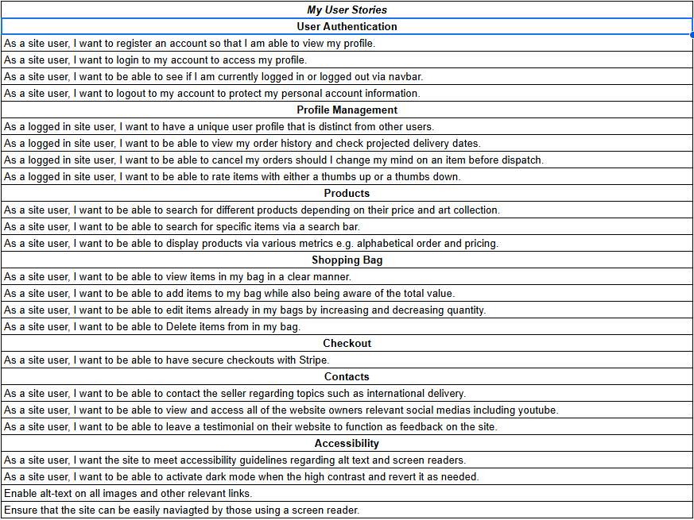

# Kal's Stitches - A portfolio project.

Welcome to my Code Institute website readme. This is for my milestone 4 project. For this I have decided to create a website for an anonymous client's textile business revolving around the sale of her textile art and cards alongside various kits used to create them. I have done this by creating a Django framework powered by a SQlite database and the web application Stripe designed to provide secure payments. This was done because the project goal was to create an effective e-commerce website.

[Click here to access the live website](https://kals-stitches-89425bfaa2b7.herokuapp.com/)

## Table of Contents

1. [Planning & Development](#planning--development)
2. [Features](#features)
3. [Testing](#testing)
4. [Deployment](#deployment)
5. [Languages](#languages)
6. [Software](#software)
7. [Code](#code)
8. [Credits](#credits)

# Planning & Development #

### Business Strategy

The concept behind this product was to try and emulate what it would be like to be a freelance web developer. To do this I worked with a client who asked me to make for her a website built for the sale of textile art sold as either cards or framed pieces. I accepted this offer because it felt like it would be a website project with a lot of wiggle room to then add my own personal flair to.

### Target Audience

For this project I opted to not do my own research and instead decided to ask the client what their target audience was at a planned interview. When I interviewed the client about their target market and inquired into who she was planning to sell these products to, she gave me the following response. She told me the target audience for her work was anyone above the age of 10 with an interest in embroidery and textile art. After travelling with the client to a Christmas market where similar businesses to hers operated, I noticed the customers there were as she described; they were of all ages and clearly displaying an interest in handmade crafts.

### User Stories

The above image displays the user stories that I will be using for my project.

### Wireframe

These are the wireframes I created to help me plan out the design of my website. The designs were not final, but they were a massive help in creating the project.

Home Screen

Product Selector

Product Details

Shopping bag

Billing details

Order Details

Account Creation

Login

User Profile

Contact

Newsletter confirmation

The newsletter page was a feature that did not make it to the final site due to requiring third party services such as Intuit MailChimp for effective use. This will later be added on in later versions of the website.

### Color Scheme

The above color scheme was rather simple to create. My mother had suggested using 3 colors initially (Dun, Nyanza Green, and Non-Photo Blue). Using those as a base, I then utilized [Colors.io](http://colors.io/) to create an applicable palette for my site. While the clients suggested colors would be used for the header, footer and body, the generated colors would be used for buttons and borders.

### Typography

When picking out an appropriate font for the website I wanted to avoid something like New Times Roman while also ensuring that it was still clear and easily read on smaller phone devices. To achieve that middle ground, I settled upon using Overpass for my font of choice.

### Database

The below database models show the relationships between all of the models in my database and their relationships. The database features for handling account logins are handled by allauth rather than my own personal code.

#### Order

|Key|Value Type|Description|
|:----|:----|:----|
|Order Number|Character|Used to track the unique order number for a customer’s transaction|
|User Profile|Foreign Key|Links the specific order to the account that created it.|
|Full Name|Character|The user’s full name.|
|Email|Character|The user's email to track receipts.|
|Phone Number|Character|The user's phone number.|
|Postcode|Character|The user’s postcode used for deliveries|
|Town/City|Character|The user’s Town or City used for deliveries|
|Street Address 1|Character|The first half of the user’s street address used for deliveries|
|Street Address 2|Character|The second half of the user’s street address used for deliveries|
|Date|Date|The date when the user's order took place|
|Delivery Cost|Decimal|The delivery fee on the order based on distance from the seller.|
|Order Total|Decimal|The total amount of all the ordered products added together.|
|Grand Total|Decimal|The combined amount of the Order Total and Delivery Cost Keys.|
|Original Bag|Text|Remembers the original bag used before payment transaction.|
|Stripe PID|Character|The Stripe PaymentIntent used for the API that handles credit card payments.|

#### OrderLineItem

|Key|Value Type|Description|
|:----|:----|:----|
|Order|Foreign Key|The order associated with the line item.|
|Product|Foreign Key|The item from the shopping bag.|
|Quantity|Integer|The amount of said shopping bag item.|
|Line-Item Total|Decimal|The price of the product times the quantity of said product.|

#### ArtCollection

|Key|Value Type|Description|
|:----|:----|:----|
|Name|Character|The name of the category for backend purposes|
|Friendly Name|Character|The name of the category for frontend purposes|

#### Product

|Key|Value Type|Description|
|:----|:----|:----|
|Art Collection|Foreign Key|The category the product belongs to.|
|SKU|Character|The unique identifier number for the product|
|Name|Character|The product name|
|Description|Text|The product description|
|Price|Decimal|How much the product costs.|
|Upvotes|Integer|How many likes a product has|
|Downvotes|Integer|How many dislikes the product has|
|Image URL|URL|The URL storing the image.|
|Image|Image|The field displaying the image itself in HTML|

#### Profile

|Key|Value Type|Description|
|:----|:----|:----|
|User|One To One|Interacts with the User model in Django.allauth|
|Default Phone Number|Character|The user's default phone number.|
|Default Postcode|Character|The user’s default postcode used for deliveries|
|Default Town/City|Character|The user’s default Town or City used for deliveries|
|Default Street Address 1|Character|The first half of the user’s default street address used for deliveries|
|Default Street Address 2|Character|The second half of the user’s default street address used for deliveries|

#### Contact

|Key|Value Type|Description|
|:----|:----|:----|
|Subject|Character|The subject of the contact email|
|Body|Text|The main body of the contact email|
|Email|Email|The user's email to use when sending their email to the server|

#### Testimonies

|Key|Value Type|Description|
|:----|:----|:----|
|Creator|Foreign Key|A foreign key with the user at the time of creating the testimony|
|Name|Character|The name of the testimony creator|
|Date|Date|The date when the testimony was created|
|Body|Text|The main body of the testimony|
|Rating|Character|A rating for what the user thought about the website from 1 to 5|

# Features #

### General

The general design of my website was inspired by the need for it to look both eye-catching yet easy to read and understand. To facilitate this, a universal feature on the website is that all buttons are either large or distinctly colored. In addition to this, all important bodies of text were surrounded in a clear border to draw attention to them first before any other on-screen elements.

### Home page

When a user first logs onto my website, the first thing that they will be met with is this screen showing the home page. It has a distinct header and a distinct footer. The header contains important links to the rest of the website, chiefly among them being the links to the products page and the shopping bag. Other important links are the link back to the home page that can be used anywhere on the site, the contact and testimonial links that take users to the means to both speak directly to the store owners and leave reviews on the website respectively. The light mode button was originally meant to be used for a light and dark mode option; however, due to time constraints, this feature will be implemented at a later date. The header also contains dropdowns that allow users to search for products based on various factors and the specific art collection they're looking for. In the center of the page is a link informing the user that a new art collection has been added to the store; clicking it will send them to the product page to view the available items. In the footer are links to various social media's associated with the store owner. Currently the links will just send users to the homepage of each site, but in the live version for the client, it will link to their business social media's. While there were several issues with CSS initially, most notably with a gap on the side of the web page, this was corrected by ensuring that the entirity of the header element was wrapped in a fluid container.

### Profile

As the pages for login, logout, and account creation are handled by allauth, I will only be speaking about the profile page in this readme. The profile page has two unique functions. One of which is to store the order history of the client so that they can check and remember what products they have bought and in what quantities. Clicking the respective order number will send the user to a separate page showing the full details of that specific order. The other important feature of the page is to allow the logged-in user to submit their delivery details here so that they can be used when they check out in the future. The development of this app was a fairly smooth experience without much in the way of struggle.

### Contact

The contact page was created with the purpose of allowing users to email the business owner with any of their inquiries. The ones signposted on the page are out-of-stock paintings and international delivery. (Limited stock will be implemented in a later version of the site.) The app works by assigning a database to the form to hold the email, subject, and body of the desired email the user wishes to send. Upon hitting the "Submit Enquiry" button, the email will be sent out to the site owner, with the user email already assigned to it to allow for communication. Developing this app required me to understand the email receipt system present in the checkout app so that I could reincorporate it into the contact app; everything was form management I had learned from all the other apps on the site.

### Testimonials

The testimonials page is the site's answer to how a user might leave a review on the site as a whole. While originally meant to be specifically product reviews, testimonials were decided upon instead due to certain time constraints. The testimonials page shows all testimonials within a box, allowing the user to scroll to find specific testimonials and preventing it from spilling far down the page. Each testimonial also generates with its own specific edit and delete buttons that offer it full CRUD functionality. The form for creating these testimonials are made up of the users name, the rating out of 5 they would give the website as well as the testimony body itself. Hitting the create testimony button will then post the testimony to the database to be displayed on the main app page. The edit button works the same; only it takes the testimony ID of the selected testimony and uses it to display that information already in the form via an instance. The delete button works by simply finding and deleting the testimony ID associated with the button.

### Products

The products page is where all the available products on the site are displayed to the user. The individual products are displayed to the user in separate cards that contain both the item price, the item name, and the image of the item itself. Items are arranged 4 in a row, which shrinks down the smaller the screen size gets to ensure proper responsiveness on mobile devices. At the top of the container there are a set of buttons. One takes the user back to the home page, and the other allows the user to search for products by a variety of criteria.
When creating the product app, my primary goal was to read clearly to the user due to the desired target audience of my anonymous client. To do that I left the work fairly uncustomized, only really changing things to give the individual icons more space. This was because bootstrap defaults have a very bright white, which contrasted very nicely with my sandstone background.

### Product Details

When a user clicks on a product image on the product page, they will be taken to the product details page. This is the page where users can get more information about a chosen item, select the quantity of the item they want, and then add it to the shopping bag. User's on the details page can clearly see the item title, the collection the item belongs to, the item price, how many upvotes and downvotes the item has (Future feature to implement), and finally how many items in the quantity box. The user has the option to click the box and manually input a price; however, an easier alternative is to click the button on either side of the box instead to increment it or decrement it by one. When the user choses to add the item to the bag, they will receive a toast informing them if it has been successfully added or not.

### Bag

The bag app is where the customers items are held up until they are ready to go on to the checkout app. Here the product's name, item, SKU code, and item quantity can be seen and highlighted by the headers above each section of it. Here, due to the bags nature of an array, the user is easily able to increase or decrease the quantity of an item if they so want it or even delete the item altogether if they change their mind. Towards the bottom, the delivery cost can be seen as a flat £10 to cover potential petrol costs in delivery as well as the cost of bubble wrapping the artwork. This delivery is then added together with the total cost of the items selected to display a grand total price for the user.

### Checkout

The checkout app is where, through the use of Stripe, the user's payments are handled and the order is then completed. On the left of the container is the Stripe form, this form first asks for the user's name and email for the use of identification. And then it requests the user's delivery information. This can be handled in a couple of ways; the user can either input their delivery details into their profile and have it automatically added to their checkout, or they can input it directly into the checkout form and then use the remember me button to add it to their profile to use for later checkouts. Of course, the user can also access the checkout app; however, they cannot save their details for later if they do this and must ultimately re-enter their details on future purchases. The Stripe form is handled by outside CSS and JS specific to the checkout app. When generated, user's can enter their credit card information. Upon submitting, the payment will be handled by Stripe securely, and webhooks on the site will interact with the associated Stripe account to give feedback on the status of the transaction. On the right are the details for their purchase, handled in a similar manner to their bag. It includes an order summary of the total amount of items requested, then the item image, name, price, and quantity of said item. Below it are the delivery charge and price totals as previously discussed. 

### Checkout Success

This is the page that handles displaying post order information that would not normally be present in the previous two screens and also to inform the user that their order was indeed successful. The unique information displayed on this page consists of the order number and the order date, the former of which is randomly generated in order to have each transaction be completely unique for the purposes of the user later being able to access their own user history. This same page is also used for displaying a user's order when they look in their profile's order history. At the bottom of the page, the user is given a button to take them back to the home page.

# Testing #

## Page Testing

Requiring much more Python code than even my previous project, this was the hardest project of the course so far. It was also the one that took the most amount of time to test because each app had to be checked and ensured that they each flowed into each other seamlessly and could call upon each other without bugs and errors where appropriate.  Finding errors in my code however was simplified since I had a tool which would inform me of any bugs and errors in the code already built in to django whereas in previous projects I would need a 3rd party dependency (Werkzeug) or simply experiment with the code until it functioned as intended. For this I will be going page by page to discuss the errors I found on each page and how I resolved them. This will also feature testing user stories, how I created each custom app not featured in Boutique Ado (for which this project was heavily based on), and finally a discussion of the different validators during development.

### Home

On my home page, I had two dropdowns called Our collections and Our artwork, respectively. These features were going to be utilized so that a user could jump straight to the products page knowing what they were looking for. However, upon testing, they did not work as intended; they would not even drop down to reveal options. After checking my JavaScript, I had realized that I was using the wrong version of PopperJS. After swapping to an earlier version, the features worked as intended. There was also the issue that they would end up showing the same HTML content despite not having the same info in the code itself. To rectify this particular error, I made sure that each dropdown had unique tags and labels; this made it so that one dropdown would not communicate with the same options. This proved to be effective and fixed my error.

### Product

When testing my product app, I had a similar issue to my homepage where I could not get my dropdowns to work. While they did indeed drop down with options and most of them worked as intended, the option to search by art collection did not work. Upon investigation, I learned that it was an error due to how I set up my search functionality. Originally, when a sort function like that was called, the search criteria was split up using underscores via JavaScript so that only the sort criteria was used and not other parts of the variable name used in the views. However, in my models, the art collection model was called art_collection. This meant that upon attempts to search for art_collection, it would instead only search for art, thus throwing up the error. To resolve this, everything with an underscore involved in the process was replaced with a - instead of _. This resolved the issue, and now all my app dropdowns work as intended.

### Product Detail

The product detail had an error that was also ultimately resolved by rolling back the site's version of popperJS. This time, rather than experiencing any issues with a dropdown, it was instead an issue where trying to use the quantity buttons provided instead refreshed the page. Rolling back popperJS did indeed resolve this issue.

### Bag

A significant issue with the development of the bag was the lack of JavaScript functionality. Initially, the update and delete buttons were nonfunctional and instead merely just refreshed the page repeatedly. When I investigated the issue, I learned that the issue was in the use of an outdated version of popperJS. Once an older version was implemented, the JavaScript worked as intended save for the toast. They would disappear far too quickly for the users to read them, and their close buttons did not work. This was fixed by giving them the missing classes to interact with Bootstrap's ARIA labels and giving them a data class to extend their timeout time to 5000 ms as opposed to the default 500 ms.

### Checkout

This app, after initial confusion with how to set up Stripe due to not properly setting up its webhooks, was mainly marred by an unresponsive layout as both sides of the container would start to merge onto each other. To rectify this, I made the bootstrap columns that were normally 6 in width only conditionally 6 depending on screen size, whilst the normal column size was set to 12. This made it so that the order information was below the checkout form and thus easier to read on mobile devices. Another error this app suffered was that upon completing the checkout operation, it would not actually take users to the checkout success page, instead just keeping them on the same page. This was because I had forgotten to add the args to the redirect function on line 78 within its views.py. Once this was added, it was able to take users to the correct page because it now could use order IDs to take it there.

### Testimony

At first, I had an issue with creating the edit feature because my attempts to try and set it up so that the form would open up with the ID's data already present in it were not working correctly. Some attempts to try to adopt earlier Flask code would even provide errors to Django. In the end, I fixed the error because I had forgotten to trigger that event in the GET method of my view rather than try and squeeze it into the post function. This then allowed the form data to be present in the edit form so that users could see what they were editing. My delete function suffered a different issue. When the modal was called to ensure the user did not accidentally delete the button when that button was pressed, even if the use was the same as the creator, it was registered as a different user, and they were sent back to the testimony page with an error toast. The reason for this was never fully understood; however, it might have been due to allauth registering the user on a page-by-page basis. Due to the code for the modal being set as an include, it counted users on that page as different from users on the original testimony page. So to fix this, I simply moved the modal code out of the include and back onto the main page, and it worked as intended.

### Contact

For contact, the only error that came up was shared by the checkout app and some allauth functionality. Due to spelling mistakes in the email section of settings.py, the emails would not send out as intended. Correcting these spelling mistakes fixed the issue.

## User Stories Testing

|Test Case Type|Description|Test Step|Expected Result|Status|
|:----|:----|:----|:----|:----|
|Functionality|User should receive confirmation their account has been created|An email should be sent to the user with a profile link|Clicking on the link in the email should send users to their account profile|Pass or fail|
|Security|Verify that the user can only sign in with the correct login details.|Make sure that created account details are within database rules for that user's login.|The user's account will be accepted if it follows the database rules for that user's login. |Pass or fail|
|Usability|User should have feedback on their login status|Have a username unique to the user|The presence of the icon or not will indicate user login status|Pass or fail|
|Security|A user's data should NOT be available to another user and only within their own session.|Logging onto an account then taking that page link to incognito mode. |Moving to incognito mode should result in that account data being inaccessible.|Pass or fail|
|Usability|Users must be easily differentiated from one another.|Unique user code and username|Users can see their username and admins can see user codes.|Pass or fail|
|Functionality|Check order histories and delivery dates.|Store orders and generated delivery dates on page in user profile.|The page will inform the user of their order history.|Pass or fail|
|Functionality|Rate items with a thumbs up or down.|Thumb icons connected to a database.|The amount of thumbs up and down will be shown on the product page. |Pass or fail|
|Usability|Arrange products based on features, e.g., price.|Drop-down menu with options, e.g., A-Z|Clicking a drop-down option will sort the catalogue in that way. |Pass or fail|
|Functionality|Search for specific products.|A search bar at the top of the screen.|Typing into the search bar will enable users to find specific items.|Pass or fail|
|Functionality|View items in the shopping bag|Users should be able to check what they are going into checkout with.|Clicking the shopping bag button should list out added items.|Pass or fail|
|Security|Secure shopping with Stripe|Create test transactions that don’t take out money|If these transactions appear on the Stripe website, then they were successful.|Pass or fail|
|Useability|Contact the seller for international sales|Have a contact page on the site|Using the form on the contact page will get them in touch with the site owner.|Pass or fail|
| Useability | View the site's social media. | Have links to social media in the website footer. | The links will take the user to the social media depending on the icon. | Pass or fail |
|Useability|Signing up for an email newsletter|Have a sign-up at the bottom of the main page.|Providing an email to that link will sign a user up for the newsletter.|Pass or fail|
|Functionality|Add items in the shopping bag|Users should be able to add items to their shopping bag.|Enable users to add items of various quantities and sizes to a shopping bag.|Pass or fail|
|Functionality|Update items in the shopping bag|Users should be able to change product amounts if they change their mind.|The shopping bag should carry the functionality to change quantity amounts. |Pass or fail|
|Functionality|Delete items in the shopping bag|Users should be able to delete products from the bag if they change their mind.| The shopping bag should carry functionally to delete added products. |Pass or fail|
|Functionality|Creating testimonials for the site|Users should be able to provide their feedback on the site via testimonials.|Testimonials should possess full CRUD functionality.|Pass or fail|

### Developing Custom Apps

#### Contact

In order to create my contact app I first had to create the app itself by setting up its views, templates, and URLs, both in its native folder and in the project folder. Within this project folder I also had to signify it as an allowed app. Once this was done, I had to create my model. In order for the desired functionality, I would need 3 fields: an email field to handle the sender email, a subject field to handle the email subject, and a body field to handle the main body of the email. Once this was created and migrated, I had to create the form itself inside of a form.py. Inside the file, I declared what model and fields I needed within the meta class of my larger ContactForm class. Inside the init definition I then had to declare how my placeholder fields would be rendered and then how the form itself would be rendered when I used crispy forms inside the template. Using widgets to identify required fields, I assigned them a star so users would know if they were needed or not. Even though all the fields are required, I decided that it would be for the best to keep them on to remove the chance of confusion on the user's part.

With this back end in place, I now had to create a view to manage this form. This form had to be able to achieve two things: one, process the form and save it to the database if it's valid information. Two, take this information and convert it into an email that can be sent to the host server as if it was sent from the submitted email. The first process was solved by storing each field as a request.POST that was then assigned in a single array called form_data. A contact_form variable was then made and assigned the argument that it should equal the contents of the form with the form_data with it. This is then checked to be valid, and if so, it is saved to the database. In order to send the email, I had to use the aptly named function send_email. This function takes 4 variables: subject, body, from email, and recipient list. In order to fill in these variables for the contact email, I set the recipient to be the default email in settings.py and then the other three were taken directly from the form itself. This way the email is sent as soon as the form is submitted. After that, the view was finished by giving it a success message informing the user the email was sent successfully, and then the relevant contexts and templates were established to allow the form to post as intended. Finally, the template was made to host the backend, and this was rather simple. Crispy form was used to host the form, and the form was set to use the contact view as an action. After that, the general site stylings were applied, and the app was completed.

#### Testimonials

The start for creating my testimonials app was similar to the contact app; however, the structure of its models and form would be notably different from that of the contact form. Starting with the model, in order to gain the desired functionality, I would need the following fields: A creator app that used the allauth user as a foreign key so that they can make multiple testimonies, but a testimony can only have a single user. A name field so that each testimony can have a distinct name; it was not linked up to the username of the current account so that users had the option to choose something different, e.g., their account username contains sensitive information. A date field would be needed so that users can know when the testimony was created. A description text field to hold the main body of the testimony itself and finally a rating field to allow the users to rate the site out of 5. For the form, out of those 5 fields, only the rating, name, and description would be asked for. The date would be automatically generated by the model upon the creation of a new entry, and the creator would be given its data at a later date. The fields are handled the exact same way as the contact form, however, in order to facilitate the use of a dropdown on the form a seperate variable outside of the TestimonyForm class had to be created called RATING_CHOICES that would hold the numbers 1-5 in an order from 1 to 5. From there, ratings would be declared as a choice form within the class and assigned as a choice field, its choices being that of the RATING_CHOICES.

The views created from this form were focused entirely on not just creating and handling the testimonies but also on affording them full CRUD functionality. The first one that had to be made was the display testimony view. The simplest view in the app merely recovered all the testimonies created on the model and then stored them as a variable to be called on the HTML page through Ginja, displayed with the name and date beside each other and both ratings along with the description below. Adding a testimony used a similar method described in contact. The form data was saved to a variable containing post requests for each of the needed variables specified in form.py. Once this data was validated, it was then saved to the database. The important change, however, was that the creator field was established by manually assigning the data for that field as requested. user, this was done so that only the user that created the testimony could edit or delete it. When editing the testimony, the view to handle it had to do two new things. It had to be able to call the ID of the testimony the user wanted to edit and ensure it was the same as the user that created it. It then had to populate the form with the same info as the testimony ID. And then save that edited ID.

The way that I did this was to ensure that when the template called for an edit via the form, both the action call and the URL called for the testimony ID. This was provided by a variable in the view that called get_object_or_404, which collected the testimony IDs. Next the view compared the current user with the user stored in the creator model. If they matched up, then the user would be given access to the edit testimony page; if they did not, they would be sent back to the testimony page with an error message. Then it checked if the page was making a GET or a POST request. If it was making a GET request, then it would use the testimony ID as an instance and populate the form using data from that instance. If the page was then making a POST request, it would save the edited data to the form as a POST request within the instance of that testimony ID, and a success message would deploy. The delete function works by finding the ID of the testimony and then simply deleting it. However, it does employ a modal before the delete view actually triggers so that the user cannot accidentally delete their testimonials. The last thing that had to be done regarding testimonials was to set up the admin.py so that testimonials would appear in the Django admin app. The reason for this is to allow for them to be moderated so that in the event of anyone making an upsetting comment, it can be deleted even if it's not the same user that created it.

## Validator Testing

### W3C Validator

This validator was used to check the integrity and quality of my HTML and CSS pages. The images for my HTML validator work will be available in read_me/validators/w3c/html; however, an example will still be provided. In regards to the HTML within the validator, I received no errors across any of the HTML pages that I tested. The errors I did end up receiving were related to the Ginja present in the code, which cannot be removed due to them being a requirement for certain views within my code to function. These Ginja errors extended not just to creating loops in the code but also when trying to use form actions to call views essential for the app's function. As for my CSS, in both of the pages my site uses, the validator returned that both of them did not have any errors at all; the evidence for this is below.

### Lighthouse Validator

This validator was used to check my website in 4 categories: Performance, Accessibility, Best Practices, and SEO (Search Engine Optimization). As can be seen from the below data, while my site never went into the red where severe problems in my site are apparent, there was still a lot of room for improvement. Most often the part of my site that was in the green was my performance, which I had noticed was only present on sites that had to render images multiple times a page. When I checked why, the reason was due to the wildly disparate sizes of the images used, which caused the page to spend a lot of processing power to try and get them to a better size.

My accessibility was my second highest-scoring category, and the main reason for this was due to several factors, but the most prevailing characteristic they all shared was this: they lacked some form of alt text. Forms had no labels; this was hard to correct as they had been automatically created by crispy forms; however, for item boxes, there were missing labels. My images lacked alt text to describe what they were to screen readers. My button lacked accessible names that could be read using a screen reader, and my links lacked names that made them distinct from each other. Speaking of my links, the core reason for my SEO being so poor was due to simply, again, having no alt text on my images. They also had an issue where they were not considered crawlable by Google; this meant that they were not wrapped in an href and using a tag but instead used something else. Attempting to look into the best packages revealed that it was caused mainly by the presence of 3rd party cookies relating to Stripe.

### Wave

The WAVE validator was used as a means to test the quality of the code on my web page. It would do this by highlighting the different parts of my websites and claim if it worked or didn't work. For example, it would highlight an empty link on my page, or it would highlight different features on my website or the aria labels present on the site. I could only check so many of the pages of my website due to errors occurring when trying to add items to the shopping bag; the images below were the only ones I was able to get. The empty links were due to the social media links in the footer of my website, and the empty button links were mostly due to buttons in my header. Missing form errors, as previously mentioned, were due to how crispy forms render their forms and as such were not something that could be edited.

# Deployment #

To deploy my site I used heroku. This was done by using the following steps.

1. Use the code institute database generator to get a unique database url for deployment.
2. Install dj_database_url and psycopg2 to handle the generated database.
3. Set up settings.py to send database data to the generated URL.
4. Load all fixtures to the URL as well as migrate all databases to it. 
5. Generating a requirements.txt file containing the python dependencies needed for the project.
6. Create a Procfile to contain the command for starting up the website.
3. Log on to Heroku.com and create a new app, while also giving it a unique name and setting the region to europe.
4. In the settings section, create a config var on the heroku app to hold the DATABASE_URL and assign it the url given by Code Institute.
5. Establish the stripe variables and django secret key to this section also.
6. Create an AWS account.
7. Set up S3 and IAM services with the relevant Users, Buckets and Policies.
8. Install django-storages and Boto3 and create custom-storages.py
9. In this file, establish the location of where the media and static files will go. This is because heroku cannot handle the deployment of static files.
10. Back in settings, set up the static files so that in the presence of the USE_AWS variable in config vars, use the setup that targets S3 for storing static and media files.
11. Make sure that all other vital variables are dependant on them being present in os.environ() rather than declared in order to prevent security flaws.
12. Select your github repo from the list and use Manual Deploy to deploy the branch of choice.
13. Click run app and enjoy! Be sure to ensure that the site works as it should and that DEVELOPMENT is set to false.

It should also be noted that debug should be set to false before publishing the website. I have done this and provided the relevant evidence below.

# Languages #

* For the development of this website I utilized HTML, CSS, JS and Python in order to create it. 

* Bootstrap 5.3.3 was used to create the accordion and for it's grid system in laying out site features.

* The framework used to construct the site was Django, which uses model-view-controller software design to build a full-stack developed website.

# Media Queries #

Media Queries were used exclusively in the role of increasing the responsiveness of web pages by...

# Software #

VS Code was used to create the website. It was the tool for typing out HTML, CSS, JS and Python code along with pushing site updates to the Github repository. Gitpod was used to provide backend and virtual environment support for the use of python without which the site would not function.

Balsamiq was used to create the wireframes saw earlier in this readme.

The microsoft snipping tool was used to take the relevant screenshots.

# Code #

https://www.wearedevelopers.com/magazine/how-to-create-a-test-plan-for-software-testing

https://boost-tool.com/en/tools/md_table

https://books.agiliq.com/projects/django-admin-cookbook/en/latest/current_user.html

# Credits #

Code Institute for the opportunity to learn and hone the craft of developing websites.

My loving and supportive family for supporting me in this endeavor.

I got the images for my website from the following sources:

https://www.textileartist.org/urban-fiber-how-cities-drive-textile-art/

https://www.jackiegaletextileart.com/store-1-5/p/indian-summer

https://www.shop.obsidianart.co.uk/products/summer-skies-textile-art-by-rachel-wright

https://www.fionarobertsonartworks.co.uk/autumn.html

https://www.jacqui-textile.com/product/spring/

https://www.jackiegaletextileart.com/store-1-1/p/spring-tide

https://thecannysquirrel.co.uk/products/winter-stag-textile-art

https://elliehipkinart.com/product/winter-light-original-painting